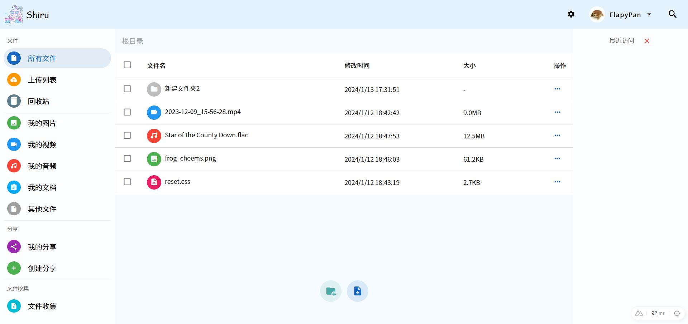
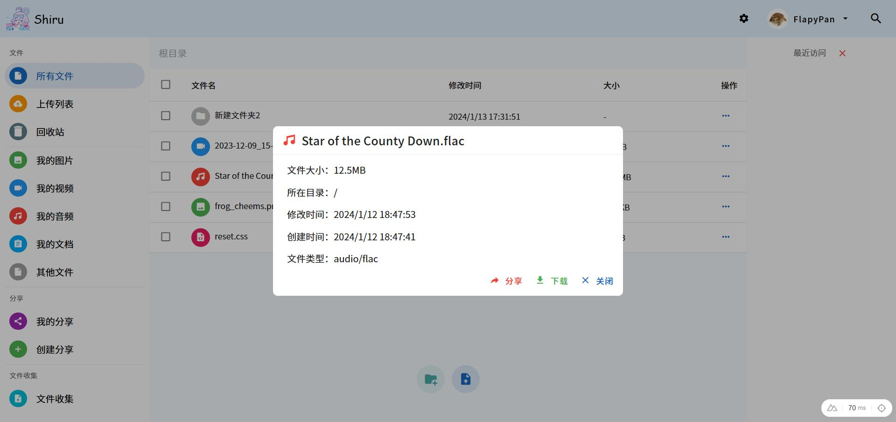

# Shiru Disk

Node.js 网盘项目，为了毕设写的一坨答辩(一堆 Bug 没修)

绝赞开发中...

## 技术栈

- Nuxt.js 3
- Vue.js 3
- Vuetify
- MongoDB
- Minio

## 前置要求

- Node.js >= 18
- MongoDB >= 5
- Minio 最新即可(懒得测了)

## 启动方法

运行前请先确保 MongoDB 和 Minio 已启动并正确配置

```shell
git clone https://github.com/FlapyPan/shiru-disk
cd shiru-disk
cp .env.example .env # 根据说明修改对应的配置
pnpm i
pnpm dev
```

## 预览




